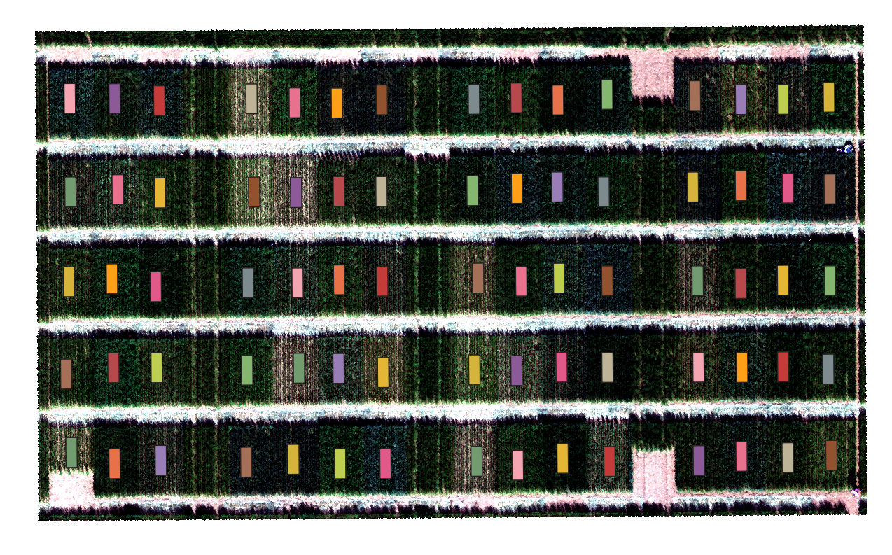

Time series vegetation indices extraction from orthomosaics and random forest analysis

This repository shows how to extract vegetation indices (VIs) from ortomosaics and how to perform random forest analysis considering time series spectral features.

